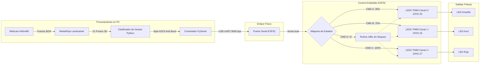
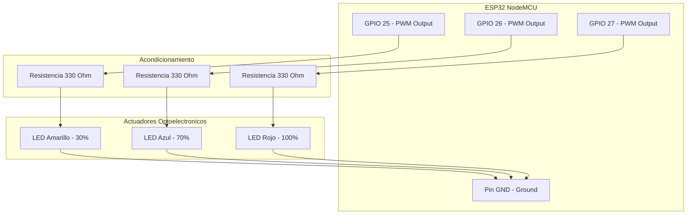
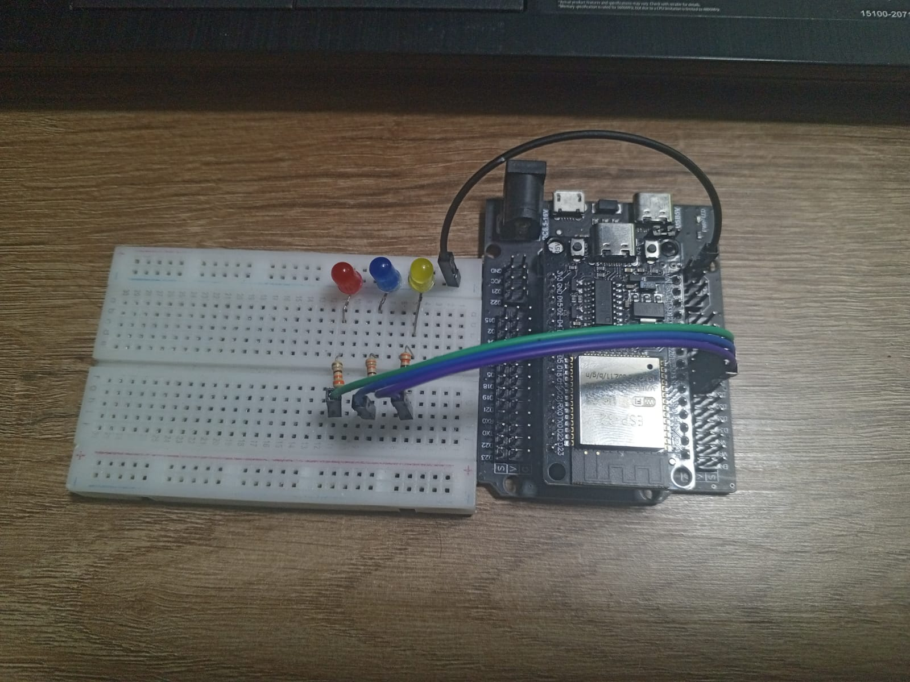
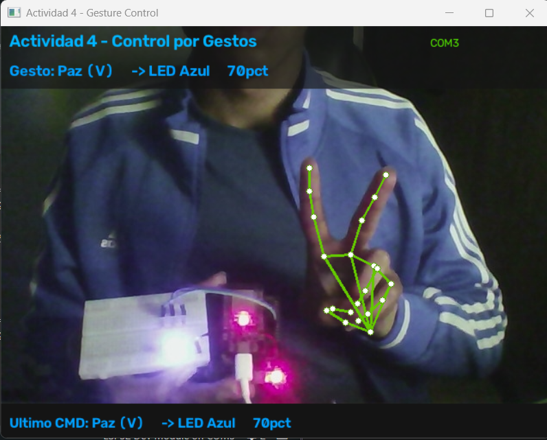
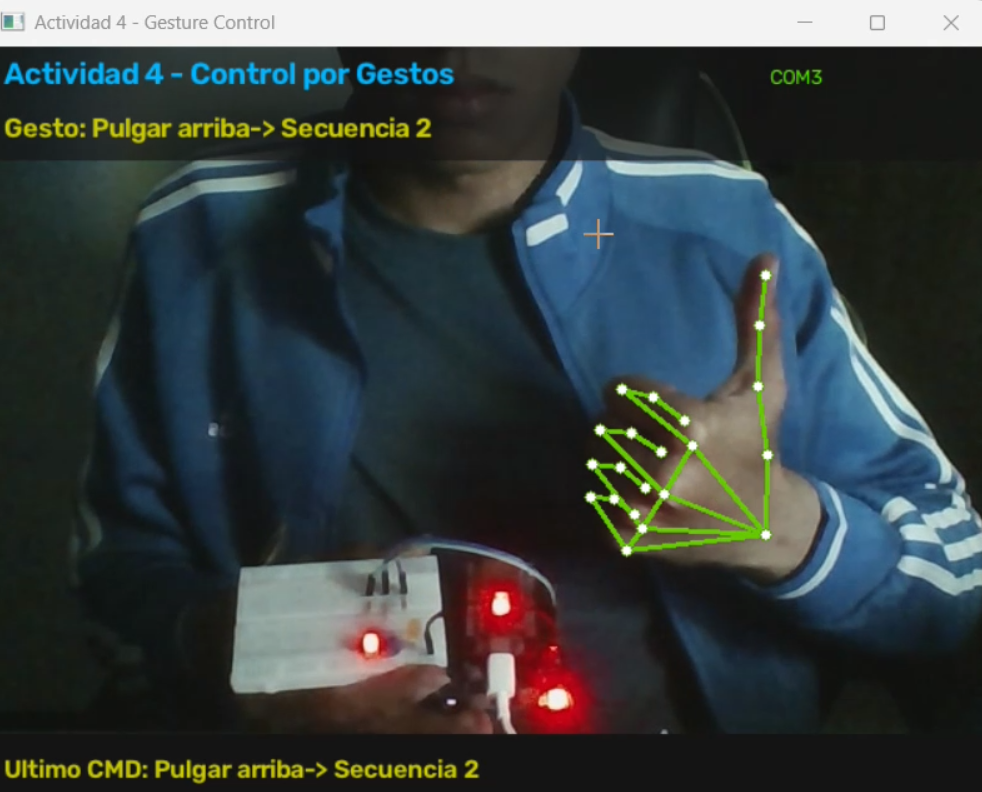

# Actividad 4: Sistema de Control de Iluminación por Gestos de la Mano (ESP32 + MediaPipe)

**Estudiante:** Johan Andrés Canchala Arenas  
**Asignatura:** Microcontroladores
**Universidad:** Universidad Militar Nueva Granada  

---

## 1. Descripción General del Proyecto

Este proyecto consiste en el diseño e implementación de un sistema de control de iluminación embebido interactivo, integrando visión artificial en tiempo real con un microcontrolador ESP32. 

A través de una cámara web, una aplicación desarrollada en Python procesa el flujo de video utilizando **MediaPipe Hand Landmarker** y **OpenCV** para identificar la postura y gestos de la mano. Los gestos clasificados se traducen en tramas seriales de un solo byte que se envían por UART hacia la placa **ESP32**, la cual realiza dos tipos de tareas:
1. **Control de Luminosidad por PWM:** Ajuste fino del Duty Cycle en los LEDs de acuerdo con el porcentaje indicado por el gesto.
2. **Interrupciones de Software (Secuencias Dinámicas):** Ejecución de rutinas de iluminación predefinidas (Modos 1 y 2) gobernadas por una máquina de estados no bloqueante con `millis()`, garantizando que el ESP32 mantenga la escucha serial activa en todo momento sin pausar la CPU con `delay()`.

---

## 2. Diagramas de Bloques y Arquitectura del Sistema

### 2.1 Diagrama de Bloques General (Flujo de Datos)



### 2.2 Explicación Modular
* **Módulo de Adquisición y Visión (Python):** Captura fotogramas a 30 FPS, normaliza el espacio de color a RGB y detecta las coordenadas de los 21 puntos articulados de la mano. Evalúa la extensión de cada dedo comparando las posiciones relativas entre las puntas (*TIPS*) y las articulaciones intermedias (*PIPS*), además de estimar la orientación del pulgar mediante vectores de desplazamiento relativo al punto MCP.
* **Módulo de Comunicación Serial:** Empaqueta el gesto detectado en un byte ASCII (`'A'`, `'B'`, `'C'`, `'D'`, `'E'`) y lo despacha por el puerto COM correspondiente. Incorpora un mecanismo de filtrado temporal anti-inundación (`SEND_DELAY = 0.15 s`) para no saturar el buffer UART del microcontrolador.
* **Módulo de Periférico PWM (ESP32):** Basado en el subsistema LEDC de la API de ESP32 (Core >= 3.x), operando con una resolución de 8 bits (valores enteros de ciclo de trabajo de 0 a 255) a una frecuencia de portadora de 5 kHz para suprimir cualquier parpadeo perceptible.
* **Módulo de Secuencias (Gestión de Interrupciones Lógicas):** Diseñado con un enfoque de concurrencia cooperativa; utiliza variables de marca de tiempo (`seqTimestamp`) y contadores de paso (`seqPaso`). Si mientras se ejecuta una secuencia ingresa un nuevo byte en `Serial.available()`, la máquina conmuta inmediatamente de modo sin esperar a que termine el ciclo actual.

---

## 3. Arquitectura Orientada a Pines (Pinout y Hardware)

### 3.1 Diagrama de Conexión de Pines



### 3.2 Tabla de Mapeo de Hardware
| Componente Físico | Pin ESP32 (GPIO) | Tipo de Señal | Nivel Lógico / Rango | Función en el Sistema |
| :--- | :---: | :---: | :---: | :--- |
| **LED Amarillo** | GPIO 25 | Salida LEDC PWM | 3.3V / Duty 0-255 | Señalización de 30% de intensidad (CMD `'A'`) |
| **LED Azul** | GPIO 26 | Salida LEDC PWM | 3.3V / Duty 0-255 | Señalización de 70% de intensidad (CMD `'B'`) |
| **LED Rojo** | GPIO 27 | Salida LEDC PWM | 3.3V / Duty 0-255 | Señalización de 100% de intensidad (CMD `'C'`) |
| **Resistencias (x3)** | - | Pasivo (330 Ω) | - | Limitación de corriente de salida (protección GPIO) |
| **GND Común** | GND | Referencia | 0V | Cátodo común para retorno del circuito |
| **Conexión Serial** | USB (UART0) | Comunicación | 9600 Baudios, 8N1 | Recepción de comandos de control desde PC |

---

## 4. Matriz de Gestos y Lógica de Activación

| Gesto Manual | Criterio Geométrico | Byte | Intensidad / Acción | Comportamiento en Placa |
| :--- | :--- | :---: | :---: | :--- |
| **Puño Cerrado** | Ningún dedo extendido; pulgar neutro/cerrado | `'A'` | **30% Intensidad** | LED Amarillo ON (`Duty = 77`), demás LEDs en 0. |
| **Señal de Paz (V)** | Índice y Medio extendidos; Anular y Meñique cerrados | `'B'` | **70% Intensidad** | LED Azul ON (`Duty = 179`), demás LEDs en 0. |
| **Mano Abierta** | Los 5 dedos completamente extendidos | `'C'` | **100% Intensidad** | LED Rojo ON (`Duty = 255`), demás LEDs en 0. |
| **Pulgar hacia Abajo** | 4 dedos cerrados, vector dY del pulgar > 0 | `'D'` | **Secuencia 1 (Modo 1)** | Rotación cíclica rápida entre los 3 LEDs y destello conjunto final. |
| **Pulgar hacia Arriba** | 4 dedos cerrados, vector dY del pulgar < 0 | `'E'` | **Secuencia 2 (Modo 2)** | Rampa progresiva de encendido escalonado y parpadeo sincronizado. |

---

## 5. Evidencias de Funcionamiento

### 5.1 Registro Fotográfico del Montaje y Pruebas

| Montaje General del Circuito | Control PWM al 70% (Señal de Paz) | Secuencia 2 Activa (Pulgar Arriba) |
| :---: | :---: | :---: |
|  |  |  |
| *Cableado desde GPIOs a protoboard mediante resistores de 330 Ω.* | *Detección de gesto de Paz (V) y respuesta del sistema en el LED Azul.* | *Identificación de pulgar arriba para iniciar degradado y parpadeo sincronizado.* |

### 5.2 Video Demostrativo del Sistema en Funcionamiento

Demostración continua en tiempo real donde se valida la captura de la webcam, la interfaz con landmarks de MediaPipe, la salida de comandos seriales y la respuesta inmediata del ESP32 sin bloqueos por delay:

▶️ **[HAGA CLIC AQUÍ PARA VER EL VIDEO DEMOSTRATIVO EN KAPWING](https://www.kapwing.com/w/KlHFMrAOsY)**

---

## 6. Estructura del Repositorio

```text
├── esp32_gesture_leds.ino   # Firmware en C++ para ESP32 (PWM LEDC + millis)
├── gesture_control.py       # Script principal en Python (MediaPipe + PySerial)
├── .gitignore               # Exclusiones de Git
├── README.md                # Documentación técnica del proyecto
└── img/                     # Registro fotográfico y diagramas del sistema
    ├── .gitkeep
    ├── Gesto_Paz.png
    ├── Gesto_pulgar_arriba.png
    └── Montaje.jpg
```

---

## 7. Instrucciones de Configuración y Despliegue

### 7.1 Carga del Firmware en el ESP32
1. Abrir `esp32_gesture_leds.ino` en el entorno Arduino IDE.
2. Seleccionar la placa objetivo: `DOIT ESP32 DEVKIT V1` o `ESP32 Dev Module`.
3. Seleccionar el puerto COM asignado por el sistema operativo (ej. `COM3`).
4. Compilar y cargar el código. *(Cerrar el monitor serie de Arduino IDE tras la carga para liberar el puerto COM)*.

### 7.2 Ejecución de la Interfaz en Python
1. Instalar las dependencias necesarias en la terminal:
   ```powershell
   pip install opencv-python mediapipe pyserial numpy
   ```
2. Descargar el archivo de modelo oficial `hand_landmarker.task` de MediaPipe y situarlo en el mismo directorio del script.
3. Verificar en la línea 7 de `gesture_control.py` que el valor coincida con el puerto COM de tu placa:
   ```python
   SERIAL_PORT = "COM3"
   ```
4. Ejecutar el script:
   ```powershell
   python gesture_control.py
   ```
5. Para detener la ejecución, presionar la tecla **`q`** sobre la ventana de OpenCV.
